<div align="center">

# CampusCoin

### Smart Financial Management for Students

A full-stack **ASP.NET Core MVC (.NET 8)** web application that brings budgeting, savings goals, reporting and **Google Gemini–powered financial guidance** together in one student-focused workspace.

[**Live Demo**](http://cashcampusapp.runasp.net/) &nbsp;·&nbsp; [**GitHub Repository**](https://github.com/kashmala123/CampusCoin)


<br/>

<a href="http://cashcampusapp.runasp.net/">
  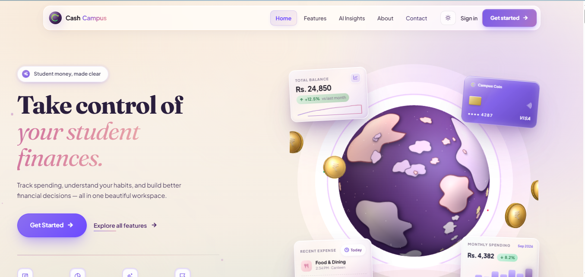
</a>

</div>

---

## Table of Contents

1. [Live Demo](#live-demo)
2. [Project Overview](#project-overview)
3. [Key Highlights](#key-highlights)
4. [Screenshots](#screenshots)
5. [Student Features](#student-features)
6. [Admin Features](#admin-features)
7. [AI-Powered Features](#ai-powered-features)
8. [Authentication & Authorization](#authentication--authorization)
9. [Technology Stack](#technology-stack)
10. [Application Architecture](#application-architecture)
11. [Database & Data Management](#database--data-management)
12. [Project Structure](#project-structure)
13. [Getting Started](#getting-started)
14. [Configuration](#configuration)
15. [Deployment](#deployment)
16. [Security Practices](#security-practices)
17. [Project Context](#project-context)
18. [My Contribution](#my-contribution)
19. [Future Vision](#future-vision)
20. [Developer](#developer)

---

## Live Demo

| | |
|---|---|
| **Application** | [cashcampusapp.runasp.net](http://cashcampusapp.runasp.net/) (served over HTTPS; HTTP requests redirect to HTTPS) |
| **Source code** | [github.com/kashmala123/CampusCoin](https://github.com/kashmala123/CampusCoin) |
| **Hosting** | MonsterASP (ASP.NET Core on .NET 8, production SQL Server database) |
| **Roles** | Student portal and Admin portal, separated by role-based access control |

---

## Project Overview

**CampusCoin** is a student-focused financial management web application. It helps students record income and expenses, set category budgets, work toward savings goals, understand their spending through reports and insights, and ask an AI coach questions about their own numbers.

Most expense trackers stop at a list of transactions. CampusCoin is built around the way students actually manage money: a monthly allowance, recurring costs, shared hostel and canteen bills, semester fee vouchers, and campus events. It combines:

- **Financial tracking**: income and expense transactions with categories, recurring entries and CSV import
- **Budget management**: monthly category limits with progress and alert thresholds
- **Savings goals**: targets, deposits and progress tracking
- **Reports and insights**: charts, monthly insights, forecasts, anomaly detection and exportable reports
- **Notifications**: in-app alerts as budgets approach or exceed their limits
- **AI-powered assistance**: a Gemini-backed coach that answers using the student's real financial data
- **Campus-oriented tools**: fee vouchers, a student wallet, roommate bill splitting and event registration

An Admin portal gives administrators oversight of students, transactions, budgets, vouchers, events and the public homepage content.

---

## Key Highlights

- **Full-stack ASP.NET Core MVC application** on **.NET 8** with C# controllers, Razor views, EF Core and SQL Server
- **Role-based access control (RBAC)** with three roles (`Student`, `Admin`, read-only `DemoAdmin`) enforced through authorization policies and `[Authorize]` attributes
- **REST-style JSON API** endpoints consumed by the front end with `fetch`, including JSON `401`/`403` responses for API routes
- **Google Gemini API integration** with ordered model fallback and a local, data-driven fallback reply so the coach always answers
- **Normalized relational schema** of 45+ entities managed through **Entity Framework Core migrations**
- **Production deployment** on MonsterASP with HTTPS and environment-based configuration
- **Responsive web application** with light/dark themes, interactive Chart.js dashboards and PDF/image report export

---

## Screenshots

### Public Website

<p align="center">
  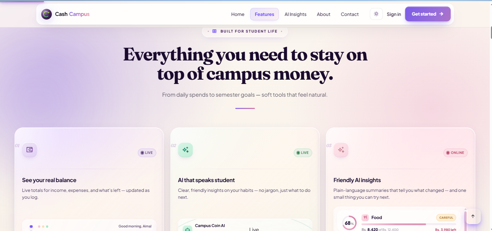
  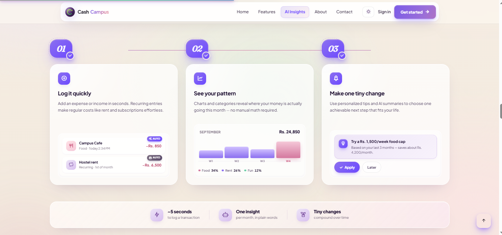
</p>
<p align="center">
  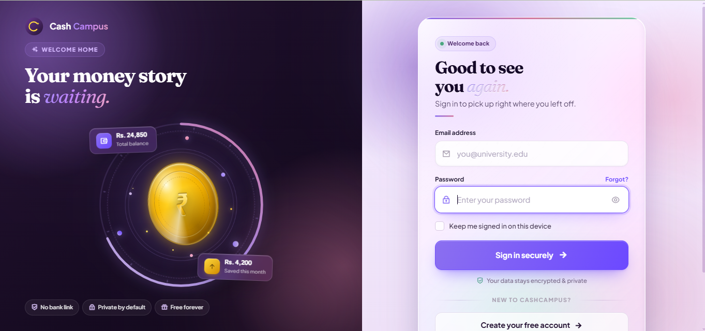
  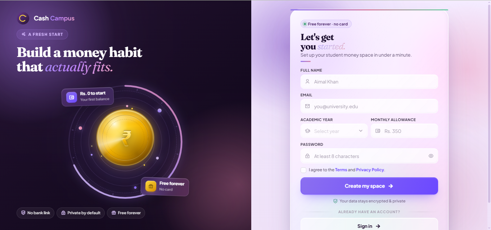
</p>
<p align="center"><em>Features overview, How It Works, secure sign-in and student registration.</em></p>

### Student Experience

<p align="center">
  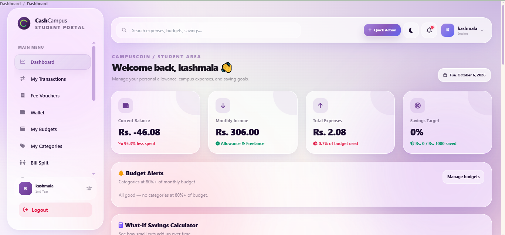
</p>
<p align="center"><em>Student dashboard: balance, income, expenses, savings target, budget alerts and a what-if savings calculator.</em></p>

<p align="center">
  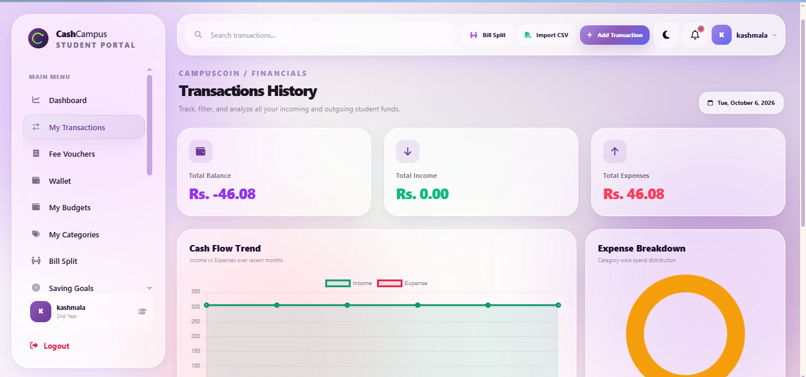
  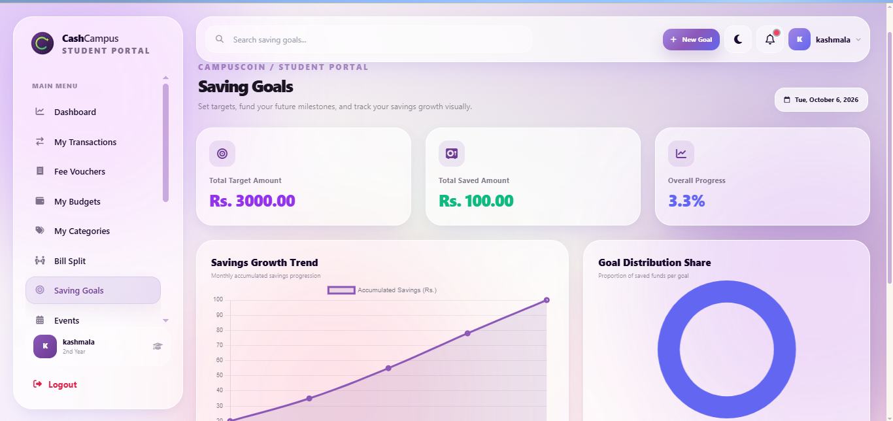
</p>
<p align="center">
  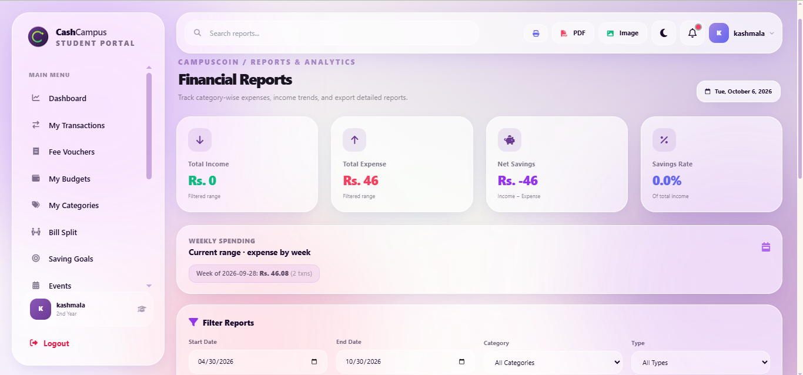
  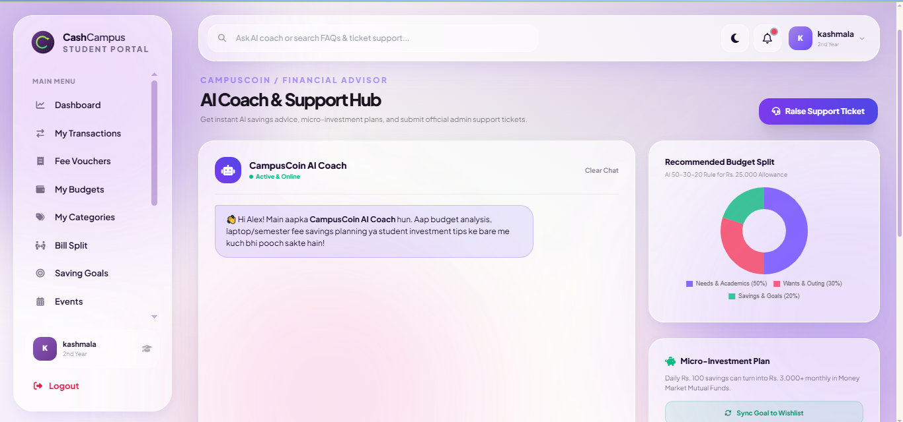
</p>
<p align="center"><em>Transactions with CSV import, savings goals, filterable reports with PDF/image export, and the AI Coach &amp; Support Hub.</em></p>

### Admin Experience

<p align="center">
  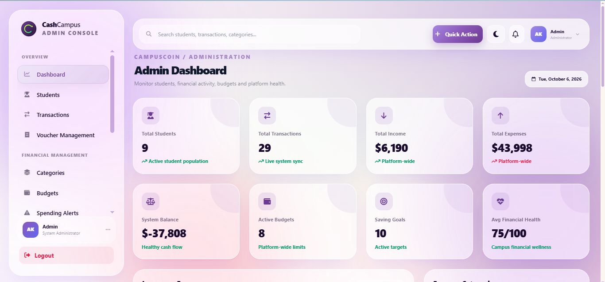
</p>
<p align="center"><em>Admin dashboard: platform-wide students, transactions, income, expenses, budgets, goals and average financial health.</em></p>

<p align="center">
  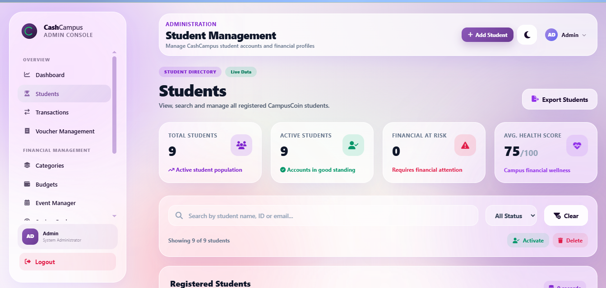
  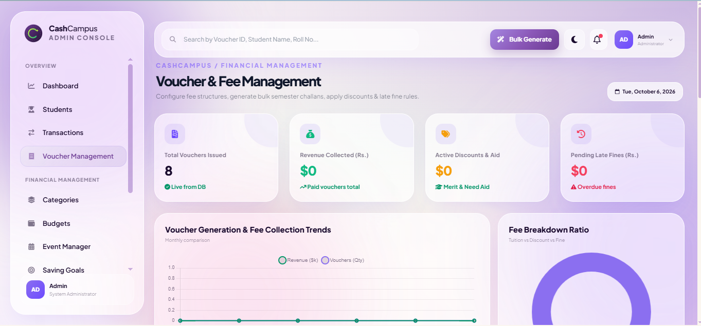
</p>
<p align="center">
  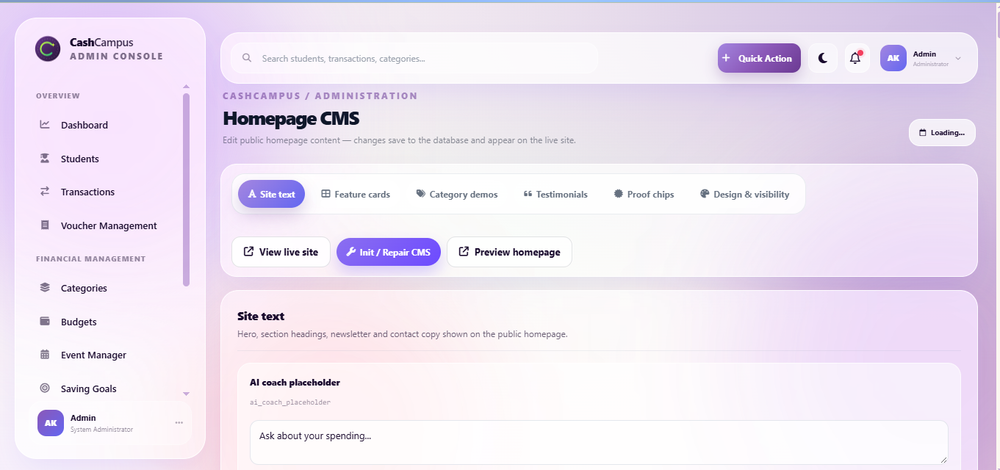
  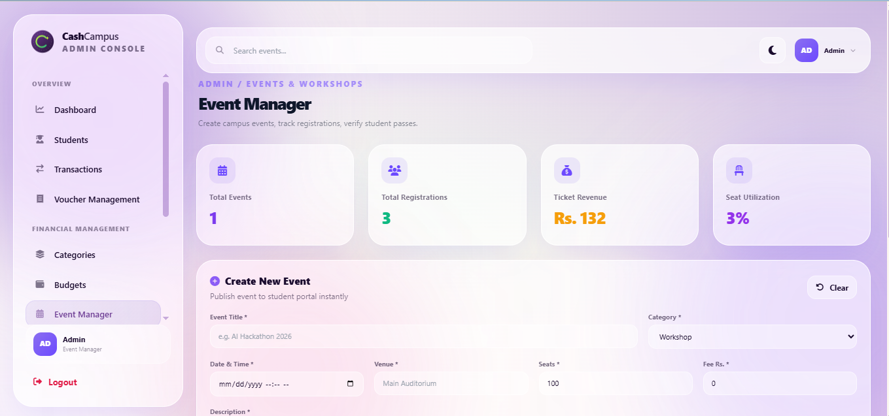
</p>
<p align="center"><em>Student management, voucher &amp; fee management, homepage CMS and event manager.</em></p>

---

## Student Features

| Area | What it does |
|---|---|
| **Dashboard** | Live balance, monthly income, total expenses and savings target; budget alerts for categories at 80%+ of their limit; interactive charts; a what-if savings calculator and an affordability simulator |
| **Transactions** | Full CRUD for income and expenses; filtering and history; recurring transactions; anomaly flags for unusual spending; next-month forecast |
| **Categories** | Built-in and personal income/expense categories; category suggestions while typing, based on keyword rules and the student's own history |
| **Budgets** | Monthly limits per category with spent/remaining tracking and in-app notifications when a limit is approached or exceeded |
| **Savings Goals** | Create goals with a target amount, add deposits, and track overall progress with growth and distribution charts |
| **Reports & Insights** | Category-wise and income-vs-expense reports, daily and weekly summaries, date/category/type filters, monthly insight, **CSV export**, **PDF and image export**, a printable report and email sharing |
| **Financial Health** | A calculated financial health score with a breakdown, plus a month-over-month expense comparison |
| **Saving Tips** | Personalized tips generated from the student's own spending by a tips engine; tips can be bookmarked or dismissed |
| **CSV Import** | Bulk-import transactions from CSV with batch category suggestions |
| **Bill Split** | Split shared costs (hostel, canteen) between roommates and track who has settled |
| **Wallet** | PIN-protected wallet with top-up, student-to-student transfers, a ledger and fee-voucher payment |
| **Fee Vouchers** | View and pay fee vouchers issued by the administration |
| **Events** | Browse and register for campus events and workshops |
| **Notifications & Bookmarks** | In-app notification centre; saved tips and monthly insights for quick access |
| **Profile** | Name, academic year, monthly allowance baseline and monthly savings goal; change password |
| **AI Coach & Support** | Chat with the AI Coach and raise support tickets with the administration |

---

## Admin Features

Administrative functionality lives in a separate portal (`/Auth/AdminLogin`, `/Admin`) and is protected by role-based authorization.

| Area | What it does |
|---|---|
| **Dashboard & Analytics** | Platform-wide totals, recent transactions, income-vs-expense and category charts, and average financial health score |
| **User Management** | Search, create, edit, activate/deactivate and delete student accounts, including bulk activate/delete and CSV export; administrator-initiated password reset with a cryptographically random temporary password |
| **Transactions, Budgets & Goals** | Review and manage students' transactions, budgets and savings goals |
| **Categories** | Manage the shared category catalogue |
| **Spending Alerts & Comparison** | Identify students nearing or exceeding budgets, send notifications, and compare month-over-month expense patterns across students |
| **Reports** | Platform-level reporting across students and categories |
| **Voucher & Fee Management** | Create vouchers, bulk-generate semester vouchers, and apply fee structure, discount and late-fine rules |
| **Event Manager** | Create and manage campus events, seat limits and fees, and review registered attendees |
| **Announcements & Notifications** | Publish announcements and send notifications to students |
| **Homepage CMS** | Edit public homepage text, feature cards, category demos, testimonials and proof chips; changes are stored in the database and appear on the live site |
| **Settings** | Administrator profile and password management |

**Role separation:** the `Student` role can only reach student pages and APIs, `Admin` has full administrative control, and `DemoAdmin` is a read-only administrator role that can view admin pages but is rejected server-side (HTTP 403) on any create, update, delete or settings operation.

---

## AI-Powered Features

CampusCoin integrates the **Google Gemini API** through a dedicated `GeminiService` and uses it in the **AI Coach**.

- **Personalized context.** For each question, the server builds a system prompt from the signed-in student's own data: academic year, monthly allowance and savings goal, current balance, this month's income and expenses, spending by category, budget usage, savings goal progress and the ten most recent transactions. Answers can therefore reference the student's real numbers.
- **Conversational interface.** Messages are validated (required, length-limited), stored per student, and can be reloaded or cleared. The chat endpoint is protected by authentication, role authorization and anti-forgery validation.
- **Resilient by design.** `GeminiService` calls the Gemini `generateContent` REST API using an ordered list of models and moves to the next model if one fails. If Gemini is unavailable, the coach answers from the student's stored data using a local fallback, so the chat never ends in a dead end.
- **Complementary intelligence.** A rule-based `SmartTipsEngine` generates saving tips from spending patterns, and `FinancialHealthService` calculates a financial health score. Category suggestions, anomaly detection and forecasting are also computed server-side.
- **Support hub.** The AI Coach page also hosts a recommended budget split and a support-ticket workflow to the administration.

AI responses are informational guidance for students. They are not professional financial advice and do not guarantee any financial outcome.

---

## Authentication & Authorization

| Concern | Implementation |
|---|---|
| **Authentication** | ASP.NET Core **cookie authentication** with a 12-hour sliding expiration; `HttpOnly` cookie with `SameSite=Lax` |
| **User store** | Custom `User` and `Role` entities in SQL Server via EF Core |
| **Password hashing** | ASP.NET Core's `IPasswordHasher<TUser>` (PBKDF2-based) for account passwords and for wallet PINs; no plaintext storage |
| **Authorization** | Named policies (`AdminOnly`, `AdminRead`, `StudentOnly`) plus `[Authorize(Roles = ...)]` on controllers and individual admin actions (**RBAC**) |
| **Separate portals** | Student sign-in and administrator sign-in are distinct; the admin portal rejects non-admin accounts |
| **Account state** | Deactivated accounts cannot sign in |
| **Password reset** | Single-use reset tokens with a 2-hour expiry; the response is identical whether or not the email exists, so account existence is not disclosed |
| **API behavior** | Requests to `/api/*` that are unauthenticated or forbidden receive JSON `401`/`403` responses instead of an HTML redirect |

---

## Technology Stack

| Category | Technology |
|---|---|
| **Language** | C# |
| **Framework** | ASP.NET Core MVC |
| **Runtime** | .NET 8 |
| **ORM** | Entity Framework Core 8 (EF Core) with migrations |
| **Database** | Microsoft SQL Server (T-SQL / SQL) |
| **Authentication** | ASP.NET Core cookie authentication, `PasswordHasher`, role-based authorization |
| **Backend APIs** | REST-style JSON endpoints in MVC controllers (CRUD, reporting, AI chat) |
| **Frontend** | HTML5, CSS3, JavaScript, Razor views, Tailwind CSS, Bootstrap 5, Font Awesome |
| **Data visualization** | Chart.js |
| **Exports** | jsPDF, html2pdf.js and html2canvas (PDF and image reports), server-side CSV export |
| **AI** | Google Gemini API (REST) |
| **Email** | SMTP via MailKit (contact form, newsletter, password reset, report sharing) |
| **Version control** | Git and GitHub |
| **Hosting** | MonsterASP, HTTPS with Let's Encrypt SSL |

---

## Application Architecture

CampusCoin follows the **MVC** pattern. Controllers handle both page rendering and JSON API endpoints, services encapsulate domain logic and external integrations, and EF Core provides data access to SQL Server.

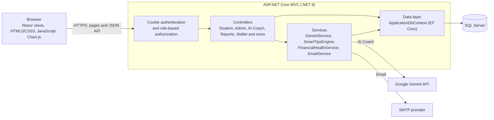

| Layer | Responsibility |
|---|---|
| **Views** | Razor views with separate public, student and admin layouts |
| **Controllers** | MVC page controllers and attribute-routed API controllers for transactions, budgets, savings goals, reports, wallet, events, vouchers, bookmarks, tips, notifications and admin operations |
| **Models** | EF Core entities plus DTOs for authentication, dashboard and transaction payloads |
| **Services** | `GeminiService` (AI), `SmartTipsEngine` (tips), `FinancialHealthService` (health score), `EmailService` (SMTP) |
| **Data** | `ApplicationDbContext`, `DbInitializer` (migrations and seeding) and EF Core migrations |

---

## How CampusCoin Works

1. **Register or sign in.** Students create an account with their academic year and monthly allowance; administrators use a separate sign-in.
2. **Log money in and out.** Income and expenses are added manually, through recurring entries, or by CSV import. Category suggestions speed this up.
3. **Set limits and goals.** Budgets per category and savings goals give each transaction context.
4. **Understand the pattern.** The dashboard, reports, forecasts, anomaly flags and health score show where money goes.
5. **Get guidance.** Saving tips and the AI Coach turn those numbers into specific next steps.
6. **Stay informed.** Notifications warn when budgets are nearing or exceeding their limits, and administrators can publish announcements.

---

## Database & Data Management

- **Entity Framework Core 8** with the SQL Server provider (code-first) and a versioned **migrations** history.
- **45+ entities** registered in `ApplicationDbContext`, covering users and roles, transactions, categories, budgets, savings goals, notifications, tips and bookmarks, recurring transactions, CSV import batches, wallet ledgers, fee vouchers, events and registrations, shared expenses and splits, chat messages, support tickets, password-reset tokens and homepage CMS content.
- **Automatic initialization.** On startup `DbInitializer` applies pending migrations and seeds roles, categories and sample data. Account passwords are never stored in source code: seeded accounts are only created when their passwords are supplied through configuration.
- **SQL script.** A SQL Server script is also provided in `CampusCoin/Database/` for manual database setup.

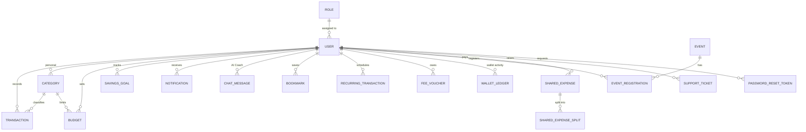

*High-level view of the core entities; the full model is defined in `Data/ApplicationDbContext.cs` and the `Models/` folder.*

---

## Project Structure

```text
CampusCoin/                          # Repository root
├── CampusCoin.sln
└── CampusCoin/                      # ASP.NET Core MVC project
    ├── Controllers/                 # MVC and API controllers (student, admin, AI coach, reports, wallet, ...)
    ├── Models/                      # EF Core entities
    │   └── DTOs/                    # Request/response data transfer objects
    ├── Data/                        # ApplicationDbContext and DbInitializer (migrations + seeding)
    ├── Services/                    # GeminiService, SmartTipsEngine, FinancialHealthService, EmailService
    ├── Views/                       # Razor views (Home, Account, Auth, Dashboard, Admin, AiCoach, ...)
    │   └── Shared/                  # Public, student and admin layouts
    ├── Migrations/                  # EF Core migrations
    ├── Database/                    # SQL Server script
    ├── wwwroot/                     # Static assets (css, js, javascript)
    ├── Properties/launchSettings.json
    ├── Program.cs                   # Service registration, authentication, authorization, pipeline
    ├── appsettings.json             # Non-secret defaults; secrets are supplied externally
    ├── global.json
    └── CampusCoin.csproj
```

---

## Getting Started

### Prerequisites

- [.NET 8 SDK](https://dotnet.microsoft.com/download/dotnet/8.0)
- SQL Server (LocalDB, Express or full edition)
- Git

### Run locally

```bash
# 1. Clone the repository
git clone https://github.com/kashmala123/CampusCoin.git
cd CampusCoin

# 2. Restore dependencies
dotnet restore

# 3. Configure secrets (see the Configuration section below)
dotnet user-secrets init --project CampusCoin
dotnet user-secrets set "ConnectionStrings:DefaultConnection" "<your SQL Server connection string>" --project CampusCoin
dotnet user-secrets set "Seed:AdminPassword" "<choose a strong password>" --project CampusCoin
dotnet user-secrets set "Seed:StudentPassword" "<choose a strong password>" --project CampusCoin

# 4. Run the application (migrations and seed data are applied on startup)
dotnet run --project CampusCoin
```

The development profile serves the app at `https://localhost:7050` (and `http://localhost:5050`).

To apply migrations manually instead, use the EF Core tools:

```bash
dotnet tool install --global dotnet-ef
dotnet ef database update --project CampusCoin
```

### Seeded accounts

No default passwords exist in source code. On first run, accounts are created only for the passwords you provide through configuration:

| Role | Seeded email | Password configuration key |
|---|---|---|
| Admin | `admin@campuscoin.com` | `Seed:AdminPassword` |
| Demo Admin (read-only) | `demo.admin@campuscoin-demo.com` | `Seed:DemoAdminPassword` |
| Student | `alex@campuscoin.com`, `ayesha@campus.edu` | `Seed:StudentPassword` |

Students sign in at `/Account/Login`; administrators sign in at `/Auth/AdminLogin`.

---

## Configuration

All sensitive values are supplied at runtime and are **not** stored in the repository. Use **environment variables**, **.NET User Secrets** (local development) or your hosting provider's configuration panel (production).

| Key (environment variable form) | Purpose |
|---|---|
| `ConnectionStrings__DefaultConnection` | SQL Server connection string |
| `Gemini__ApiKey` | Google Gemini API key (optional; the AI Coach uses its local fallback without it) |
| `Email__Enabled` | Turns SMTP email on or off |
| `Email__Host` / `Email__Port` | SMTP server and port |
| `Email__UserName` / `Email__Password` | SMTP credentials |
| `Email__FromName` / `Email__FromEmail` | Sender display name and address |
| `Email__UseStartTls` | Use STARTTLS for the SMTP connection |
| `Seed__AdminPassword` or `CAMPUSCOIN_ADMIN_PASSWORD` | Password for the seeded Admin account |
| `Seed__DemoAdminPassword` or `CAMPUSCOIN_DEMO_ADMIN_PASSWORD` | Password for the seeded read-only Demo Admin |
| `Seed__StudentPassword` or `CAMPUSCOIN_STUDENT_PASSWORD` | Password for the seeded demo students |

In configuration files and User Secrets, nested keys use a colon (for example `Email:Host`); as environment variables they use a double underscore (`Email__Host`).

---

## Deployment

CampusCoin is deployed to production on **MonsterASP**.

- **Platform:** ASP.NET Core application targeting **.NET 8**
- **Database:** production **SQL Server** database; EF Core migrations are applied on startup
- **Configuration:** environment-based settings; connection string, API keys and credentials are provided through hosting configuration rather than source control
- **HTTPS:** TLS secured with a **Let's Encrypt** certificate; HTTP requests are redirected to HTTPS, and production runs with HSTS and a custom error handler
- **Production URL:** [cashcampusapp.runasp.net](http://cashcampusapp.runasp.net/)

---

## Security Practices

- **Secrets outside source control.** Connection strings, API keys, SMTP credentials and seed passwords are read from environment variables, User Secrets or hosting configuration; the repository contains only empty placeholders.
- **Authentication and RBAC.** Cookie authentication with `HttpOnly` and `SameSite` cookies, role-based policies, and role checks on every controller and sensitive admin action.
- **Password hashing.** Passwords and wallet PINs are hashed with ASP.NET Core's `PasswordHasher`; there are no default or plaintext credentials.
- **Read-only administrator role.** `DemoAdmin` is enforced server-side so it cannot modify data.
- **Anti-forgery protection.** `[ValidateAntiForgeryToken]` is applied to sensitive endpoints such as the AI Coach, wallet operations and bookmark changes, with token support for JSON requests via a request header.
- **Secure random generation.** Administrator-issued temporary passwords, voucher codes and event codes are generated with `System.Security.Cryptography.RandomNumberGenerator`.
- **Safe password reset.** Single-use, expiring reset tokens and non-disclosing responses.
- **Input validation.** Model validation on authentication requests and explicit validation on AI chat messages (required and length-limited).
- **Parameterized data access.** All database access goes through Entity Framework Core, which parameterizes queries.
- **Transport security.** HTTPS redirection and HSTS in production.

---

## Project Context

CampusCoin was developed as an **Aptech TechWiz End-to-End Web Solution** project. The goal was to design and deliver a complete, deployable web product for a real-world problem: helping students understand and control their money.

The project spans the full development lifecycle: requirements analysis, relational database design, backend development in ASP.NET Core, authentication and role-based authorization, a responsive front end, **AI integration** with the Google Gemini API, and **production deployment** to a public host.

---

## My Contribution

I worked as a **full-stack developer** on CampusCoin, with a focus on the public-facing application and the backend and dynamic functionality that powers it.

- **Backend development in C# / ASP.NET Core MVC (.NET 8):** built controllers, services and REST-style JSON endpoints following the MVC pattern
- **Database integration:** worked with **Entity Framework Core** and **SQL Server**, including entities, relationships and migrations
- **Authentication and authorization:** implemented cookie-based sign-in, hashed credentials, password reset and **role-based access control** across Student and Admin areas
- **Dynamic, data-driven functionality:** connected forms and pages to live data through API calls, covering CRUD workflows for transactions, budgets, savings goals, categories and student-facing features
- **AI and API integration:** integrated the **Google Gemini API** with context-aware prompts and a graceful local fallback, plus SMTP email integration
- **Frontend development:** HTML5, CSS3 and JavaScript for the responsive public site and student experience, including Chart.js visualizations
- **Production deployment and configuration:** deployed to MonsterASP with HTTPS, a production SQL Server database, and environment-based **secure configuration** using environment variables
- **Git and GitHub:** version control and repository management for the project

---

## Future Vision

- Deeper AI-powered insights, such as proactive spending summaries and goal recommendations
- Richer analytics and comparison views for both students and administrators
- Expanded financial planning tools for semester and long-term goals
- Additional integrations that connect CampusCoin with campus services

---

## Developer

**Kashmala Khan**
Full-Stack Developer · C# · ASP.NET Core MVC · .NET 8 · SQL Server

- GitHub: [@kashmala123](https://github.com/kashmala123)
- Repository: [github.com/kashmala123/CampusCoin](https://github.com/kashmala123/CampusCoin)
- Live application: [cashcampusapp.runasp.net](http://cashcampusapp.runasp.net/)

<div align="center">

*CampusCoin: smart spending, student style.*

</div>
